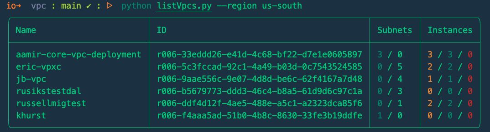
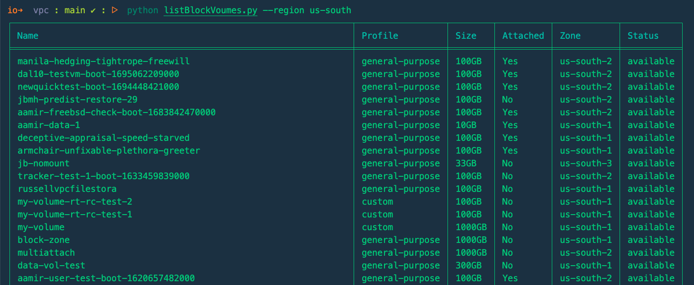
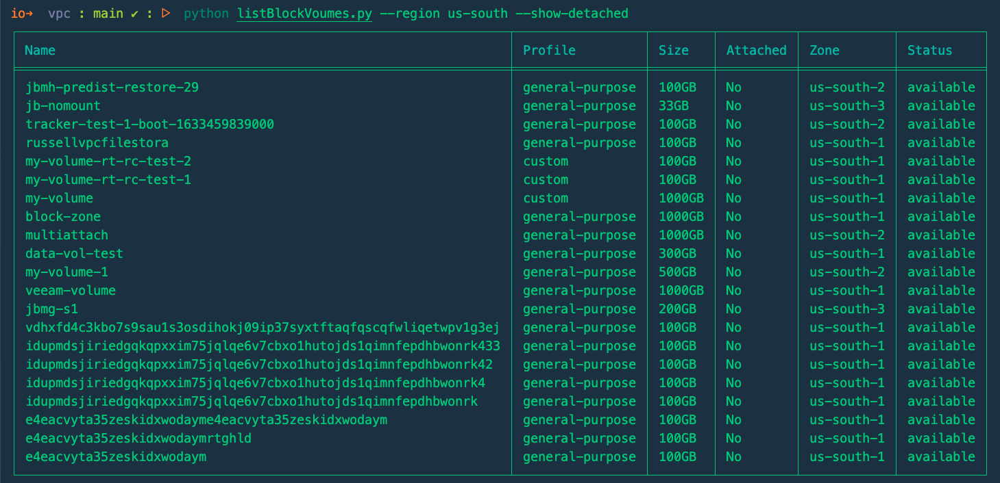

# Python VPC Scripts

Handy scripts for interacting with IBM Cloud VPC API

## Install dependencies

```shell
pip install -r requirements.txt
```

## Export API Key

```shell
export IBMCLOUD_API_KEY=<YOUR API KEY>
```

---

## Scripts

### List VPCs in region

Pretty simple, mainly used to test output stuff related to `rich` python module.

```shell
python listVpcs.py --region <VPC Region>
```



### List all Block volumes in the region

```shell
python listBlockVoumes.py --region <VPC Region>
```



You can also use the `--show-detached` flag to only return the volumes that are not currently attached to any instances.

```shell
python listBlockVoumes.py --region <VPC Region> --show-detached
```


